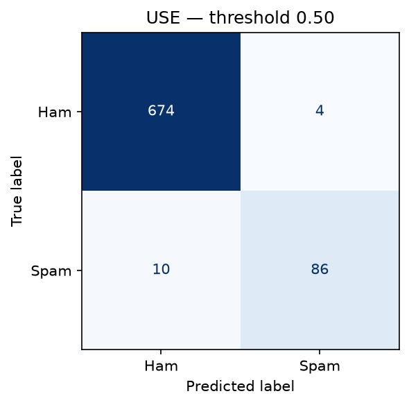

# AT&T Spam Detector

Deep-learning SMS spam classifier developed as part of the Jedha Data Science & Deployment certification.

## Project objective

AT&T users receive large volumes of unwanted SMS messages. The objective of this project is to build an automated classifier capable of predicting whether an SMS message is **spam** or **ham (legitimate)** using only the textual content of the message.

The project follows a progressive deep-learning workflow:

1. explore and prepare the SMS dataset;
2. establish a simple neural-network baseline;
3. investigate a recurrent sequence model;
4. apply transfer learning with pretrained sentence representations;
5. compare the frozen models on a held-out test set.

Particular attention is given to **data leakage prevention, class imbalance, business-relevant error analysis, reproducibility, and model generalization**.

## Dataset

The project uses the SMS Spam Collection dataset provided for the AT&T spam-detection challenge.

After reconstructing fragmented CSV fields and removing exact duplicate SMS messages, the modeling dataset contains:

* **5,158 unique SMS messages**
* **4,516 ham messages (87.55%)**
* **642 spam messages (12.45%)**

The data is split using stratified sampling into:

| Split      | Messages | Purpose                                         |
| ---------- | -------: | ----------------------------------------------- |
| Training   |    3,610 | Model fitting and vocabulary construction       |
| Validation |      774 | Architecture assessment and threshold selection |
| Test       |      774 | Final held-out generalization evaluation        |

Exact duplicate messages are removed **before splitting**, preventing the same SMS text from appearing in both training and evaluation data.

The test set remains untouched throughout model development and is used only during the final evaluation.

## Preprocessing strategy

Exploratory analysis showed that spam messages frequently differ from legitimate messages in their use of numbers, currency symbols, URLs, capitalization, and punctuation.

For this reason, aggressive text cleaning is deliberately avoided.

The word-level baseline and GRU models use a training-only `TextVectorization` pipeline with:

* lowercasing;
* punctuation stripping;
* whitespace tokenization;
* a sequence length of **50 tokens**, covering approximately 99% of training messages;
* a dedicated `[EMPTY]` representation for messages that become empty after punctuation removal.

The `[EMPTY]` handling prevents punctuation-only messages from becoming fully padded sequences.

The transfer-learning model instead operates on the original reconstructed SMS text using the pretrained **Universal Sentence Encoder (USE)** and therefore does not use the word-level vectorizer.

## Modeling approach

Three neural-network approaches are developed progressively. Each model is evaluated on validation data before moving to the next level of complexity.

### 1. Embedding baseline

The first model establishes a deliberately simple deep-learning baseline:

**Token IDs → Embedding → Global Average Pooling → Dense → Dropout → Sigmoid**

The model uses binary cross-entropy because spam detection is a binary classification problem and the network outputs a probability through a sigmoid activation.

A threshold of **0.40** is selected using validation data.

### 2. GRU sequence model

The second model introduces sequence awareness:

**Token IDs → Embedding → GRU → Dense → Dropout → Sigmoid**

Unlike global average pooling, the GRU can model token order and sequential dependencies.

Its validation-selected threshold of **0.89** produces a conservative spam classifier with very high precision.

### 3. Universal Sentence Encoder transfer learning

The final experiment uses transfer learning with the pretrained **Universal Sentence Encoder v4** from TensorFlow Hub.

**Raw SMS → Frozen USE encoder → 512-dimensional embedding → Dense classifier → Sigmoid**

USE is used as a frozen feature extractor. Only the classification head is trained on the SMS dataset, resulting in **69,825 trainable parameters** in the classifier.

Its validation-selected threshold is **0.50**.

## Validation-based model selection

Model and threshold decisions are made using validation data only.

| Model                      | Threshold |  Precision |     Recall |         F1 |    ROC-AUC |     PR-AUC | False positives | False negatives |
| -------------------------- | --------: | ---------: | ---------: | ---------: | ---------: | ---------: | --------------: | --------------: |
| Embedding baseline         |      0.40 |     0.8932 | **0.9485** |     0.9200 |     0.9939 |     0.9531 |              11 |           **5** |
| GRU                        |      0.89 | **1.0000** |     0.8866 |     0.9399 |     0.9847 |     0.9640 |           **0** |              11 |
| Universal Sentence Encoder |      0.50 |     0.9479 |     0.9381 | **0.9430** | **0.9982** | **0.9883** |               5 |               6 |

USE provides the strongest overall validation balance and is therefore selected as the leading model **before the test set is evaluated**.

The baseline achieves slightly higher spam recall, while the GRU eliminates validation false positives at the cost of missing more spam. USE provides the highest validation F1, ROC-AUC, and PR-AUC while maintaining strong precision and recall.

## Final held-out test results

After model selection and threshold tuning are complete, the frozen models are evaluated on the previously untouched test set.

| Model                      | Threshold |   Accuracy |  Precision |     Recall |         F1 |    ROC-AUC |     PR-AUC | False positives | False negatives |
| -------------------------- | --------: | ---------: | ---------: | ---------: | ---------: | ---------: | ---------: | --------------: | --------------: |
| Embedding baseline         |      0.40 |     0.9703 |     0.9011 |     0.8542 |     0.8770 |     0.9836 |     0.9425 |               9 |              14 |
| GRU                        |      0.89 |     0.9780 | **1.0000** |     0.8229 |     0.9029 |     0.9755 |     0.9403 |           **0** |              17 |
| Universal Sentence Encoder |      0.50 | **0.9819** |     0.9556 | **0.8958** | **0.9247** | **0.9854** | **0.9678** |               4 |          **10** |

### Final model

The **Universal Sentence Encoder classifier** is retained as the final model.

On the held-out test set it achieves:

* **98.19% accuracy**
* **95.56% spam precision**
* **89.58% spam recall**
* **92.47% spam F1-score**
* **0.9854 ROC-AUC**
* **0.9678 PR-AUC**

The final confusion matrix contains:

* **674** correctly classified ham messages;
* **86** correctly detected spam messages;
* **4** legitimate messages incorrectly classified as spam;
* **10** spam messages incorrectly classified as ham.



### Business interpretation

False positives and false negatives have different operational consequences.

A **false positive** means that a legitimate SMS may be incorrectly blocked, potentially hiding an important message from a user. A **false negative** means that an unwanted spam message reaches the user.

The GRU is the most conservative model: it produces zero false positives on the test set, but misses 17 spam messages. USE accepts four false positives while detecting seven additional spam messages compared with the GRU.

USE therefore provides the strongest overall trade-off for the final system rather than simply maximizing one metric.

## Error analysis

The final USE model makes 14 errors on the 774-message test set: 4 false positives and 10 false negatives.

The false positives include legitimate messages with characteristics that can resemble spam, such as unusual formatting, capitalization, abbreviated language, and announcement-like wording.

The false negatives include several messages with recognizable spam indicators such as `"FREE"`, ringtone offers, mobile-content language, chat services, and unsolicited promotional wording. Some of these receive very low spam probabilities, while others lie close to the 0.50 classification threshold.

This shows that the remaining errors are not purely threshold-related. Lowering the threshold could recover some borderline spam messages, but it would also increase false positives and would not solve the highest-confidence false negatives.

The final threshold is therefore kept at the validation-selected value of **0.50**.

## Data augmentation

Data augmentation was considered but deliberately excluded from the final pipeline.

SMS spam classification depends strongly on short lexical and structural cues such as:

* phone numbers;
* URLs;
* prices and currency symbols;
* promotional terms;
* abbreviations;
* punctuation;
* calls to action.

Generic text augmentation techniques such as random word deletion, synonym replacement, or word swapping could modify exactly the features that determine whether an SMS is spam and may introduce label noise.

The final USE classifier already generalizes well to unseen data, reaching a test F1-score of **0.9247** and a PR-AUC of **0.9678**.

For this reason, augmentation is not introduced without a domain-specific justification. A future experiment could investigate controlled augmentation methods, but they should be compared against the same unaugmented architecture.

## Repository structure

```text
4_Att-spam-detector/
│
├── data/
│   ├── raw/                # Original dataset - ignored by Git
│   └── processed/          # Train/validation/test splits - ignored by Git
│
├── models/                 # Saved model artifacts - ignored by Git
│
├── notebooks/
│   ├── 01_data_exploration_preprocessing.ipynb
│   ├── 02_deep_learning_baseline.ipynb
│   ├── 03_sequence_model.ipynb
│   ├── 04_transfer_learning.ipynb
│   └── 05_final_evaluation.ipynb
│
├── outputs/
│   ├── figures/            # Selected evaluation figures
│   └── metrics/            # Generated metric files - ignored by Git
│
├── src/
│   └── __init__.py
│
├── .gitignore
├── README.md
└── requirements.txt
```

## Reproducibility

The project was developed with:

* Python **3.12.7**
* TensorFlow **2.21.0**
* TensorFlow Hub **0.16.1**
* TF-Keras **2.21.0**
* NumPy **2.5.2**
* Pandas **3.0.5**
* scikit-learn **1.9.0**
* Matplotlib **3.11.1**

All Python dependencies are pinned in `requirements.txt`.

### Installation

Clone the repository and install the dependencies:

```bash
pip install -r requirements.txt
```

The raw dataset should then be placed at:

```text
data/raw/spam.csv
```

The project uses the SMS Spam Collection dataset provided for the challenge.

The transfer-learning notebook also downloads the pretrained Universal Sentence Encoder v4 from TensorFlow Hub:

```text
https://tfhub.dev/google/universal-sentence-encoder/4
```

An internet connection is therefore required the first time the transfer-learning model is executed.

## Notebook execution order

Run the notebooks sequentially:

```text
01_data_exploration_preprocessing.ipynb
        ↓
02_deep_learning_baseline.ipynb
        ↓
03_sequence_model.ipynb
        ↓
04_transfer_learning.ipynb
        ↓
05_final_evaluation.ipynb
```

### Notebook roles

**01 — Data exploration & preprocessing**

* reconstructs the raw CSV;
* audits missing values, duplicates, and encoding issues;
* analyzes class imbalance and SMS length;
* removes exact duplicate SMS messages;
* creates stratified train, validation, and test splits;
* investigates tokenization and sequence length.

**02 — Deep-learning baseline**

* builds the embedding + global-average-pooling network;
* identifies and fixes the punctuation-only masking edge case;
* evaluates validation performance;
* selects the baseline operating threshold.

**03 — Sequence model**

* trains a GRU-based classifier;
* compares it with the baseline;
* analyzes the precision/recall trade-off;
* selects the GRU threshold using validation data.

**04 — Transfer learning**

* loads the pretrained Universal Sentence Encoder;
* extracts frozen 512-dimensional semantic representations;
* trains a small dense classification head;
* compares USE against the previous models;
* selects USE as the leading validation candidate.

**05 — Final evaluation**

* loads the untouched test set;
* reconstructs the frozen preprocessing pipelines;
* evaluates all three models at their validation-selected thresholds;
* compares final generalization metrics;
* performs final USE error analysis;
* records the final model decision.

## Methodology safeguards

Several safeguards are used throughout the project to keep evaluation reliable:

* duplicate SMS messages are removed before splitting;
* splits are stratified by class;
* the word vocabulary is learned from training data only;
* thresholds are selected from validation data only;
* the held-out test set is not used for model or threshold selection;
* test-set errors are analyzed descriptively without further tuning;
* preprocessing decisions are documented and reproduced consistently.

## Final takeaway

A simple neural baseline already performs strongly on this dataset, while the GRU improves precision at the cost of spam recall.

The best overall result comes from transfer learning with the **Universal Sentence Encoder**, showing that pretrained semantic representations are particularly effective for a relatively small and imbalanced SMS classification dataset.

The final USE classifier achieves a held-out test F1-score of **0.9247** and PR-AUC of **0.9678**, while limiting errors to **4 false positives and 10 false negatives**.
